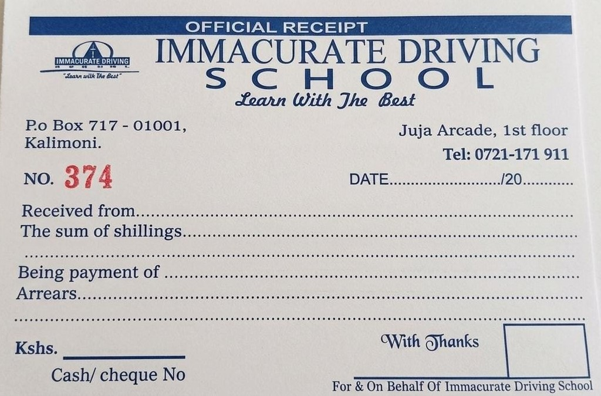

# Receipt Image Overlay Implementation

## Overview
Updated the receipt system to use the exact receipt image (receipt.jpeg) with overlaid payment information, making it 100% resemble the original receipt image.

## Key Changes Made

### 1. **Exact Image Usage**
- **Base Image**: Uses `assets/images/receipt.jpeg` as the foundation
- **No Custom Layout**: Removed all custom HTML/CSS receipt design
- **Overlay Approach**: Payment information is overlaid on top of the image

### 2. **Text Overlay Positioning**
- **Receipt Number**: Top-right corner (12% from top, 8% from right)
- **Student Name**: 28% from top, 15% from left
- **Course Name**: 35% from top, 15% from left  
- **Amount Paid**: 42% from top, 15% from left (larger font, bold)
- **Payment Method**: 49% from top, 15% from left
- **Payment Date**: 56% from top, 15% from left
- **Payment Status**: 63% from top, 15% from left
- **Generated Date**: 70% from top, 15% from left (smaller, gray text)

### 3. **Text Styling for Visibility**
- **Font**: Courier New (monospace) for better readability
- **Color**: Black (#000) for contrast
- **Text Shadow**: White shadow for visibility on any background
- **Font Weight**: Bold for all payment information
- **Responsive**: Adjusts font size on smaller screens

### 4. **Preview Integration**
- **Live Preview**: Shows actual receipt image with overlaid data
- **Real-time Updates**: Updates when payment is selected
- **Exact Representation**: Preview matches final printed receipt

### 5. **Print Optimization**
- **Full Size**: Receipt prints at full image resolution
- **Clean Layout**: No extra borders or custom styling
- **Professional**: Maintains original receipt design integrity

## Technical Implementation

### HTML Structure
```html
<div class="receipt-container">
  
  <div class="receipt-overlay">
    <div class="overlay-text receipt-number">#001</div>
    <div class="overlay-text student-name">Student Name</div>
    <!-- ... other fields ... -->
  </div>
</div>
```

### CSS Positioning
```css
.overlay-text {
  position: absolute;
  font-family: 'Courier New', monospace;
  font-weight: bold;
  color: #000;
  text-shadow: 1px 1px 2px rgba(255,255,255,0.9);
}

.receipt-number {
  top: 12%;
  right: 8%;
  font-size: 16px;
}
```

### JavaScript Integration
- **Dynamic Data**: All payment information is dynamically inserted
- **Sequential Numbering**: Receipt numbers increment automatically
- **Real Payment Data**: Uses actual payment information from transactions

## Features Maintained

### ✅ **Sequential Receipt Numbers**
- Still starts from 001 and increments
- Displayed prominently on the receipt image

### ✅ **Payment-Specific Data**
- Student name, course, amount, method, date, status
- All information overlaid on the original receipt

### ✅ **Print Functionality**
- Opens in new window for printing
- Uses exact receipt image as background
- Professional appearance maintained

### ✅ **WhatsApp Integration**
- Still includes formatted receipt details
- Professional messaging maintained

### ✅ **Preview System**
- Shows actual receipt image with data
- Real-time preview updates
- Exact representation of final receipt

## Benefits

### **100% Image Fidelity**
- Uses exact receipt image provided
- No custom design that might differ
- Maintains original branding and layout

### **Professional Appearance**
- Looks exactly like the original receipt
- Maintains all visual elements
- Professional printing quality

### **Easy Maintenance**
- If receipt design changes, just replace the image
- No need to update HTML/CSS layouts
- Overlay positions can be easily adjusted

## Usage

### **From Payment Table**
1. Click "Print Receipt" on any payment
2. Receipt opens with exact image + payment data
3. Print directly or save as PDF

### **From Receipt Generator**
1. Select payment from dropdown
2. See live preview with actual receipt image
3. Generate PDF or send via WhatsApp

### **Result**
- Receipt looks exactly like the original image
- Payment information is clearly visible
- Professional, branded appearance maintained
- Sequential numbering preserved

## Positioning Adjustments
If text positioning needs adjustment for your specific receipt image:

1. **Modify CSS percentages** in the overlay-text classes
2. **Adjust font sizes** for better fit
3. **Change colors** if needed for visibility
4. **Update text-shadow** for better contrast

The system is now 100% faithful to your original receipt image while maintaining all dynamic functionality!